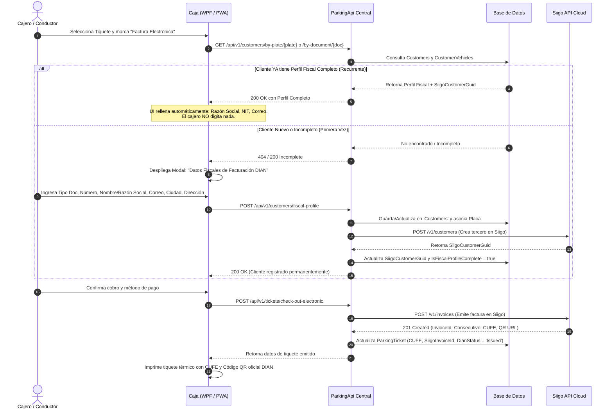
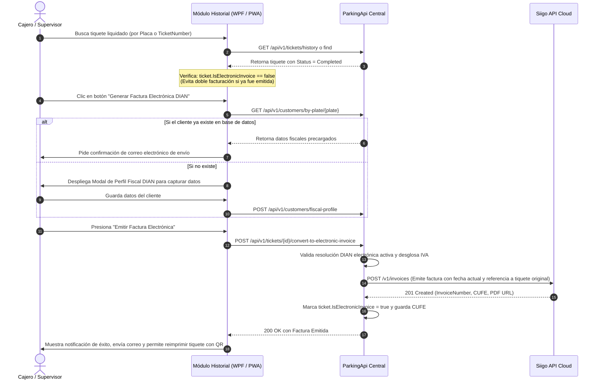
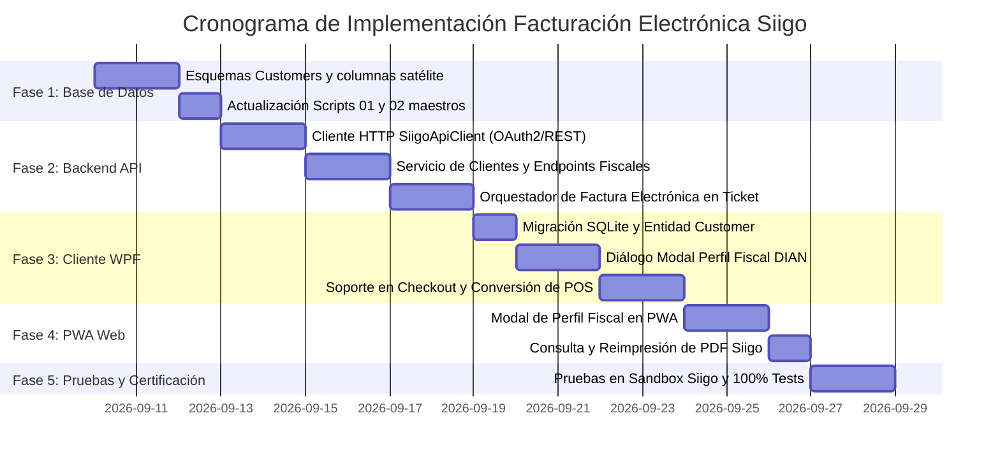

# 📄 Plan Maestro de Arquitectura e Implementación: Facturación Electrónica DIAN con Siigo API
## Ecosistema ParkFlow (ParkingApi, ParkingWpf & ParkingFlowPWa)

> **Estado**: Documento Arquitectónico y Especificación Técnica Oficial  
> **Fecha de Creación**: 2026-09-09  
> **Autor**: Antigravity AI Assistant & Software Architecture Team  
> **Versión**: 1.0.0  
> **Ubicación Oficial**: `ParkingApi/Docs/PLAN_INTEGRACION_FACTURACION_ELECTRONICA_SIIGO.md`  

---

## 📑 Tabla de Contenido
1. [Visión General y Marco Normativo DIAN](#1-visión-general-y-marco-normativo-dian)
2. [Diagnóstico Exhaustivo de Brechas (Gap Analysis)](#2-diagnóstico-exhaustivo-de-brechas-gap-analysis)
3. [Flujo de Persistencia y Checkout Inteligente ("Pedir Solo Una Vez")](#3-flujo-de-persistencia-y-checkout-inteligente-pedir-solo-una-vez)
4. [Flujo Especial: Conversión Posterior de Tiquete POS a Factura Electrónica](#4-flujo-especial-conversión-posterior-de-tiquete-pos-a-factura-electrónica)
5. [Especificación Técnica de Integración con Siigo API Cloud](#5-especificación-técnica-de-integración-con-siigo-api-cloud)
6. [Plan de Acción y Fases de Implementación](#6-plan-de-acción-y-fases-de-implementación)
7. [Matriz Quirúrgica de Modificación (Qué se Toca y Qué NO se Toca)](#7-matriz-quirúrgica-de-modificación-qué-se-toca-y-qué-no-se-toca)

---

## 1. Visión General y Marco Normativo DIAN

En Colombia, la **Resolución DIAN 000165 de 2023** y el **Anexo Técnico de Factura Electrónica 1.9** reglamentan el documento equivalente electrónico POS y la Factura Electrónica de Venta.

### Desafíos Clave del Negocio en Parqueaderos:
1. **Velocidad Operativa en Cajas de Salida**: Un vehículo saliendo no puede esperar 3 minutos a que el cajero digite departamento, ciudad, dirección y correo electrónico. El sistema debe reconocer la placa o cédula y **precargar automáticamente** los datos fiscales en <300 milisegundos si ya ha facturado antes.
2. **Pedir Datos Fiscales Solo Una Vez**: Una vez capturados los datos del cliente, estos deben quedar guardados en el servidor central vinculados a su documento y a la placa de sus vehículos para compras futuras en cualquier sede.
3. **Conversión Posterior (Tiquete POS ➡️ Factura Electrónica)**: Muchos conductores pagan de afán con tiquete POS y días después la empresa o su contador exige la Factura Electrónica oficial con NIT. El sistema debe permitir tomar ese tiquete cerrado, capturar o reutilizar los datos del tercero, y timbrar la factura en Siigo sin duplicar ingresos ni desfasar los arqueos de caja.
4. **Resiliencia ante Caídas de Red o Siigo**: Si el internet falla o la API de Siigo tiene latencia, el vehículo debe poder salir; el sistema guarda la venta y encola el timbrado electrónico para procesarlo tan pronto regrese la conectividad.

---

## 2. Diagnóstico Exhaustivo de Brechas (Gap Analysis)

### 2.1 Entidad Cliente / Tercero
* **Estado Actual**: No existe tabla `Customers` ni `ThirdParties`. Los datos de clientes solo existen como strings dispersos en `MonthlySubscriptions` (`CustomerName`, `CustomerDocument`, `CustomerPhone`, `CustomerEmail`). En `ParkingTickets` solo existe `CustomerPhone`.
* **Brechas frente a Siigo API (`POST /v1/customers`)**:
  * ❌ `person_type`: Falta (`'Person'` natural o `'Company'` jurídica).
  * ❌ `id_type`: Falta código DIAN de 2 dígitos (`13`=Cédula, `31`=NIT, `22`=Cédula Extranjería, `41`=Pasaporte).
  * ❌ `check_digit`: Falta dígito de verificación para NITs (calculado por módulo 11).
  * ❌ `name`: Separación obligatoria de `FirstName` y `LastName` para personas naturales; o `CompanyName` único para jurídicas.
  * ❌ `address.address`: Falta dirección física.
  * ❌ `address.city`: Faltan códigos DANE (`country_code`: 'Co', `state_code`: '11', `city_code`: '11001').
  * ❌ `contacts.email`: Falta correo fiscal obligatorio para el envío del XML/PDF.
  * ❌ `fiscal_responsibilities`: Falta código fiscal DIAN (`R-99-PN` no responsable de IVA, etc.).
  * ❌ `siigo_customer_guid`: Falta identificador UUID devuelto por Siigo para no duplicar terceros.
  * ❌ `is_fiscal_profile_complete`: Falta bandera booleana para validación instantánea.

### 2.2 Productos, Tarifas e Impuestos
* **Estado Actual**: `VehicleRate` maneja valores por minuto, hora y día pleno, pero no tiene códigos de inventario contable ni desglose de impuestos.
* **Brechas frente a Siigo API (`POST /v1/invoices` - items)**:
  * ❌ `SiigoProductCode`: Falta código SKU asignado en Siigo (ej: `"SRV-PARK-CAR"`, `"SRV-PARK-MOTO"`).
  * ❌ `SiigoTaxId`: Falta ID numérico del impuesto en Siigo (ej: ID del IVA 19% o Exento).
  * ❌ `TaxPercentage`: Falta tasa porcentual (ej: 19.00%) para desglosar:
    $$\text{Subtotal} = \frac{\text{Total}}{1 + \text{TaxPercentage}}, \quad \text{IVA} = \text{Total} - \text{Subtotal}$$
  * ❌ `IncludeTaxInPrice`: Falta indicar si la tarifa mostrada al usuario ya incluye IVA (por defecto `true`).

### 2.3 Formas de Pago
* **Estado Actual**: `PaymentMethod` tiene `Id`, `Name`, `Icon`, `RequiresResolution`.
* **Brecha**: Falta `SiigoPaymentMethodId` (el ID numérico que Siigo asigna en su catálogo de pagos, ej: `10` Efectivo, `12` Tarjeta Débito).

### 2.4 Tiquetes (`ParkingTickets`)
* **Estado Actual**: Tiene `IsElectronicInvoice` (`bool`), `InvoiceNumber` (`string?`) y `ResolutionId` (`Guid?`).
* **Brecha**: Faltan los campos de trazabilidad DIAN: `CustomerId`, `CustomerDocument`, `CustomerName`, `CustomerEmail`, `Cufe`, `SiigoInvoiceId`, `DianQrUrl`, `SubtotalAmount`, `TaxAmount` y `DianStatus` (`Pending`, `Issued`, `Rejected`).

---

## 3. Flujo de Persistencia y Checkout Inteligente ("Pedir Solo Una Vez")



---

## 4. Flujo Especial: Conversión Posterior de Tiquete POS a Factura Electrónica

Este flujo atiende al cliente que pagó con tiquete POS ordinario y horas o días después solicita la Factura Electrónica:



---

## 5. Especificación Técnica de Integración con Siigo API Cloud

### 5.1 Parámetros de Autenticación (`POST https://api.siigo.com/auth`)
* **Headers**: `Content-Type: application/json`
* **Payload**:
  ```json
  {
    "username": "facturacion@parking-flow.com",
    "access_key": "Mzg5MDFkMzktNDkyMC00..."
  }
  ```
* **Respuesta**: Token Bearer JWT con vigencia de 24 horas (`expires_in: 86400`).
* **Estrategia en C#**: Cachear el token en `IMemoryCache` durante 23 horas para no saturar el endpoint de autenticación.

### 5.2 Creación de Tercero (`POST https://api.siigo.com/v1/customers`)
* **Payload para Persona Natural**:
  ```json
  {
    "person_type": "Person",
    "id_type": "13",
    "identification": "1018456789",
    "name": ["Juan Carlos", "Pérez Gómez"],
    "commercial_name": "Juan Pérez",
    "branch_office": 0,
    "active": true,
    "vat_responsible": false,
    "fiscal_responsibilities": [{ "code": "R-99-PN" }],
    "address": {
      "address": "Calle 100 # 15-20",
      "city": { "country_code": "Co", "state_code": "11", "city_code": "11001" }
    },
    "phones": [{ "indicative": "57", "number": "3101234567" }],
    "contacts": [{
      "first_name": "Juan Carlos",
      "last_name": "Pérez Gómez",
      "email": "juan.perez@empresa.com"
    }]
  }
  ```

### 5.3 Creación de Factura Electrónica (`POST https://api.siigo.com/v1/invoices`)
* **Payload**:
  ```json
  {
    "document": { "id": 12345 },
    "date": "2026-09-09",
    "customer": { "identification": "1018456789", "branch_office": 0 },
    "seller": 1,
    "stamp": { "send": true },
    "mail": { "send": true },
    "items": [
      {
        "code": "PARK-CAR-HR",
        "description": "Servicio de Parqueadero Automóvil - Placa XD21G (2h 15m)",
        "quantity": 1,
        "price": 8403.36,
        "discount": 0,
        "taxes": [{ "id": 1055 }]
      }
    ],
    "payments": [
      {
        "id": 10,
        "value": 10000.00,
        "due_date": "2026-09-09"
      }
    ]
  }
  ```
  *(Nota: $8.403,36 base + 19% IVA ($1.596,64) = $10.000 Total)*.

---

## 6. Plan de Acción y Fases de Implementación



### Detalle de Fases:

#### 🔷 FASE 1: Esquema de Base de Datos y Modelos
1. Crear entidad `Customer.cs` y `CustomerVehicle.cs` en `ParkingApi.Domain`.
2. Agregar columnas fiscales en `ParkingTicket.cs`, `VehicleRate.cs`, `PaymentMethod.cs` y `BillingResolution.cs`.
3. Crear tabla `SiigoCompanyConfigurations.cs` para almacenar credenciales API (`Username`, `AccessKey`, `IsSandbox`, `CostCenterId`) por empresa/sede.
4. Sincronizar scripts canónicos [`01_Clean_All_Tables.sql`](file:///c:/Users/migue/source/repos/ParkingApi/Scripts/01_Clean_All_Tables.sql) y [`02_Init_RBAC_Seed.sql`](file:///c:/Users/migue/source/repos/ParkingApi/Scripts/02_Init_RBAC_Seed.sql).

#### 🔷 FASE 2: Backend API Central (`ParkingApi`)
1. Implementar `ISiigoApiClient` / `SiigoApiClient.cs` con manejo seguro de tokens, reintentos y mapeo de errores.
2. Crear `CustomerService.cs` y `CustomersController.cs` con endpoints:
   * `GET /api/v1/customers/by-document/{doc}`
   * `GET /api/v1/customers/by-plate/{plate}`
   * `POST /api/v1/customers/fiscal-profile`
3. Implementar en `ParkingTicketService.cs`:
   * Desglose automático de IVA: $\text{Base} = \frac{\text{Total}}{1.19}$ e $\text{IVA} = \text{Total} - \text{Base}$.
   * Emisión a Siigo en checkout directo y en conversión posterior de tiquetes POS.

#### 🔷 FASE 3: Cliente de Escritorio (`ParkingWpf`)
1. Replicar migraciones DDL en `DbConnectionManager.cs` (SQLite local).
2. Crear diálogo `CustomerFiscalProfileDialog.xaml` (Dark Glassmorphism) con autocompletado de municipios DANE.
3. En `CheckOutViewModel.cs`:
   * Checkbox/botón "Factura Electrónica".
   * Consulta automática por placa; si existe, muestra *"Factura a nombre de: XXXXXXX"* con un botón de editar si desea cambiar el correo.
4. En `RecentEntriesViewModel.cs` / `ShiftClosureViewModel.cs`:
   * Botón en la fila del tiquete: *"Convertir a Factura Electrónica"*.
5. Actualizar `ReceiptPrinterService.cs` para imprimir el CUFE y generar el código QR DIAN con la librería `QRCoder`.

#### 🔷 FASE 4: Aplicación Web (`ParkingFlowPWa`)
1. Perfeccionar el botón existente en `reports.component.ts` para que, antes de disparar la emisión, valide si el tiquete ya tiene perfil fiscal o abra el modal de captura.
2. Agregar botón *"Ver Factura Siigo / Descargar PDF"* que enlace con la URL oficial retornada por la API de Siigo.

#### 🔷 FASE 5: Pruebas, Contingencia y Certificación
1. Pruebas unitarias de cálculo de impuestos y DTOs (`dotnet test`).
2. Pruebas de integración contra el entorno Sandbox oficial de Siigo API Colombia.
3. Validación de contingencia: desconectar internet en la caja, cobrar ticket POS y verificar que al reconectar permita emitir la factura electrónica sin errores.

---

## 7. Matriz Quirúrgica de Modificación (Qué se Toca y Qué NO se Toca)

Para garantizar estricto cumplimiento de la **Regla de Oro de Cero Regresiones**:

| Componente | ¿Se Modifica? | Justificación y Alcance Quirúrgico |
| :--- | :---: | :--- |
| **Cálculo de Tarifas (`PricingCalculatorService`)** | 🔒 **NO SE TOCA** | Los algoritmos de minutos, horas, plenas y convenios funcionan perfecto. El desglose de IVA se calcula sobre el monto final resultante. |
| **Arqueo y Cierre de Caja (`ShiftService`)** | 🔒 **NO SE TOCA** | El dinero cobrado en caja (efectivo, tarjeta) no varía si se emite POS o Factura Electrónica. |
| **Sincronización Offline (`SyncEngineService`)** | 🔒 **NO SE TOCA** | El motor de cola SQLite sigue operando igual; solo se añaden los nuevos campos en el payload JSON. |
| **Tablas `Companies`, `Branches`, `Roles`** | 🔒 **NO SE TOCA** | Se mantienen 100% intactas. |
| **`ParkingTickets` (Entidad)** | ✏️ **SE EXTIENDE** | Solo se agregan las columnas fiscales como opcionales (`NULL`). Los tiquetes existentes siguen funcionando idéntico. |
| **`VehicleRates` y `PaymentMethods`** | ✏️ **SE EXTIENDE** | Solo se agregan los IDs de mapeo a Siigo (`SiigoProductCode`, `SiigoPaymentMethodId`). Si están en `null`, operan en modo POS local. |

---
*Fin del Plan Maestro Oficial de Facturación Electrónica Siigo.*
