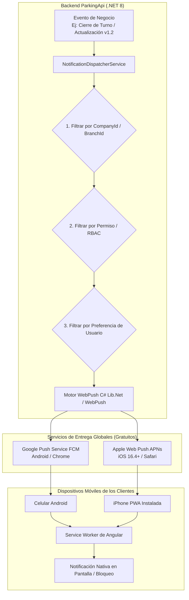

# 📱 PLAN DE ARQUITECTURA: NOTIFICACIONES PUSH PWA MULTI-EMPRESA Y PARAMETRIZABLES (100% GRATIS)

> **Estado**: Planificación aprobada para análisis y posterior implementación.  
> **Ámbito**: `ParkingApi` (Backend C# .NET 8) y `ParkingFlowPWa` (Frontend Angular 20 PWA).  
> **Costo de Infraestructura**: **$0 USD** (Estándar Web Push W3C + VAPID sin intermediarios de pago).

---

## 🎯 1. Resumen Ejecutivo y Objetivos

El objetivo de este módulo es permitir que **Parking Flow PWA** envíe notificaciones en tiempo real a los teléfonos móviles (Android e iOS) de operadores, supervisores y dueños de parqueaderos, **incluso con la aplicación cerrada o la pantalla bloqueada**, con las siguientes características esenciales:

1. **Avisos de Actualización de la PWA**: Notificar cuando exista una nueva versión del sistema en producción para que el usuario actualice la aplicación al instante con un solo toque.
2. **Aislamiento Multi-Tenant Estricto**: Ningún evento o notificación de una compañía será emitido a usuarios de otra compañía. Las sedes también están aisladas: un operario de la Sede Norte no recibe eventos de la Sede Sur.
3. **RBAC Basado en Permisos (Sin Roles Quemados)**: El envío se filtra evaluando los slugs de permisos del usuario (`Action.Slug`), garantizando que la información sensible (como arqueos o dinero) solo llegue a quienes tengan autorización.
4. **Parametrización por Usuario**: Cada usuario podrá activar o desactivar en su perfil qué notificaciones desea recibir y cuáles no.
5. **Costo Cero ($0)**: Utiliza el protocolo estándar **Web Push + VAPID**, consumiendo directamente los servicios gratuitos de Google (FCM Web Push) y Apple (APNs Web Push) sin pagar mensualidades a OneSignal, Twilio o Firebase Blaze.

---

## 📱 2. Compatibilidad y Comportamiento en Dispositivos Móviles

| Sistema Operativo | Soporte Técnico | Comportamiento |
| :--- | :--- | :--- |
| **Android** (Chrome, Edge, Samsung Internet) | **Nativo y completo** | Recibe notificaciones con sonido y vibración con la app abierta, minimizada o cerrada, y con la pantalla bloqueada. |
| **iOS / iPhone** (Safari) | **Soportado desde iOS 16.4** | **Requiere que la PWA esté agregada a la pantalla de inicio** (*Add to Home Screen*). Una vez instalada, muestra alertas, sonidos y badge numérico en el icono exactamente igual a una app nativa. |
| **Seguridad** | **HTTPS Obligatorio** | El estándar Web Push exige certificados SSL válidos (activo en producción). En desarrollo local opera sobre `localhost`. |

---

## 🏗️ 3. Diagrama de Arquitectura y Flujo de Datos



---

## 🗂️ 4. Catálogo de Notificaciones y Reglas de Segmentación

| Categoría | Evento / Disparador | Destinatarios Típicos | Permiso Requerido (Slug) | Parametrizable |
| :--- | :--- | :--- | :--- | :---: |
| **🚀 SISTEMA** | Nueva versión de la PWA lista para desplegar | Todos los usuarios activos de la empresa | General / Acceso al sistema | Sí |
| **💰 CAJA / TURNOS** | Apertura de turno o caja | Administradores, Supervisores | `shifts.audit` / `cash.view` | Sí |
| **💰 CAJA / TURNOS** | Cierre de turno y arqueo con resumen de dinero | Dueño del negocio, Administrador | `shifts.audit` / `shifts.manage` | Sí |
| **⚠️ DISCREPANCIAS** | Descuadre en arqueo (faltante o sobrante superior al umbral) | Dueño del negocio | `shifts.audit` | Sí |
| **🚗 VEHÍCULOS** | Registro de incidente o novedad (golpe, rayón, etc.) | Operarios de patio de la sede, Administradores | `incidents.view` | Sí |
| **⏱️ VEHÍCULOS** | Vehículo supera tiempo máximo (ej: >12h o >24h) | Operarios de la sede activa | `operations.tickets` | Sí |
| **🔒 SEGURIDAD** | Anulación de ticket o descuento extraordinario | Dueño del negocio | `tickets.cancel_audit` | Sí |

---

## 💾 5. Diseño de Base de Datos Propuesto

### Tabla 1: `PushSubscriptions` (Dispositivos Registrados)
Almacena las credenciales de cifrado y el endpoint único que el navegador o celular otorga a la PWA.

```sql
CREATE TABLE PushSubscriptions (
    Id INT IDENTITY(1,1) PRIMARY KEY,
    UserId INT NOT NULL,
    CompanyId INT NOT NULL,
    BranchId INT NULL,
    Endpoint NVARCHAR(MAX) NOT NULL,
    P256dh NVARCHAR(500) NOT NULL,
    Auth NVARCHAR(500) NOT NULL,
    DeviceName NVARCHAR(200) NULL,      -- Ej: "Samsung S23", "iPhone 14"
    UserAgent NVARCHAR(500) NULL,
    IsActive BIT NOT NULL DEFAULT 1,
    CreatedAt DATETIME2 NOT NULL DEFAULT GETUTCDATE(),
    LastSentAt DATETIME2 NULL,
    CONSTRAINT FK_PushSubscriptions_Users FOREIGN KEY (UserId) REFERENCES Users(Id) ON DELETE CASCADE,
    CONSTRAINT FK_PushSubscriptions_Companies FOREIGN KEY (CompanyId) REFERENCES Companies(Id),
    CONSTRAINT FK_PushSubscriptions_Branches FOREIGN KEY (BranchId) REFERENCES Branches(Id)
);

CREATE INDEX IX_PushSubscriptions_User_Branch ON PushSubscriptions(UserId, BranchId);
CREATE INDEX IX_PushSubscriptions_Company ON PushSubscriptions(CompanyId);
```

### Tabla 2: `UserNotificationPreferences` (Preferencias por Usuario)
Permite que cada usuario decida qué notificaciones desea recibir.

```sql
CREATE TABLE UserNotificationPreferences (
    Id INT IDENTITY(1,1) PRIMARY KEY,
    UserId INT NOT NULL UNIQUE,
    NotifyAppUpdates BIT NOT NULL DEFAULT 1,       -- Avisos de nueva versión PWA
    NotifyShiftOpen BIT NOT NULL DEFAULT 0,        -- Aperturas de caja
    NotifyShiftClose BIT NOT NULL DEFAULT 1,       -- Cierres de turno
    NotifyCashDiscrepancy BIT NOT NULL DEFAULT 1,  -- Descuadres de dinero
    NotifyVehicleIncidents BIT NOT NULL DEFAULT 1, -- Novedades con vehículos
    NotifyOverdueVehicles BIT NOT NULL DEFAULT 0,  -- Estancias prolongadas
    UpdatedAt DATETIME2 NOT NULL DEFAULT GETUTCDATE(),
    CONSTRAINT FK_UserNotificationPreferences_Users FOREIGN KEY (UserId) REFERENCES Users(Id) ON DELETE CASCADE
);
```

---

## ⚙️ 6. Componentes Técnicos a Implementar

### A. Backend (`ParkingApi`)
1. **Paquete NuGet**: `WebPush` (o `Lib.Net.Http.WebPush`). Libre de costo y sin intermediarios.
2. **Configuración VAPID (`appsettings.json`)**:
   ```json
   "Vapid": {
     "Subject": "mailto:soporte@parkingflow.com",
     "PublicKey": "CLAVE_PUBLICA_GENERADA",
     "PrivateKey": "CLAVE_PRIVADA_GENERADA"
   }
   ```
3. **Servicio `NotificationDispatcherService`**:
   - Recibe eventos del dominio.
   - Aplica el filtro: `CompanyId` -> `BranchId` -> Permiso RBAC (`Action.Slug`) -> `UserNotificationPreferences`.
   - Cifra el payload en formato JSON estándar Web Push y lo envía al endpoint del celular.
   - Limpia automáticamente endpoints caducados (`410 Gone` o `404 Not Found`).
4. **Controlador `PushSubscriptionController`**:
   - `GET /api/push-subscriptions/public-key`: Retorna la clave pública VAPID.
   - `POST /api/push-subscriptions/subscribe`: Registra o actualiza el dispositivo.
   - `POST /api/push-subscriptions/unsubscribe`: Inactiva el dispositivo.
   - `GET /api/push-subscriptions/preferences`: Obtiene las preferencias del usuario.
   - `PUT /api/push-subscriptions/preferences`: Actualiza las preferencias del usuario.
   - `POST /api/admin/push/broadcast-update`: Endpoint protegido para emitir avisos de versión del sistema.

### B. Frontend (`ParkingFlowPWa`)
1. **Servicio `PushNotificationService`**:
   - Inyecta `SwPush` (del paquete nativo `@angular/service-worker`).
   - Solicita la llave pública al backend y ejecuta `swPush.requestSubscription({ serverPublicKey })`.
   - Envía el token generado al backend asociado al usuario y sede activa.
2. **Manejador de Clics (`swPush.notificationClicks`)**:
   - Si el usuario pulsa una notificación de tipo `APP_UPDATE`: enfoca la PWA y dispara `swUpdate.activateUpdate()`.
   - Si pulsa una notificación de cierre de turno: navega directo a `/dashboard/shifts`.
3. **Pantalla de Ajustes de Notificaciones**:
   - Switch principal: *"Activar notificaciones en este dispositivo"*.
   - Switches de categorías (solo visibles si el usuario posee los permisos correspondientes).

---

## 💼 7. Modelo Comercial para Venta a Comercios y Parqueaderos

1. **"El Control de tu Parqueadero en tu Bolsillo"**:
   - El dueño del negocio no necesita estar físicamente en la caseta ni llamar por teléfono a los cajeros.
   - Su celular le avisa cada cierre de turno con el resumen de recaudo exacto y le alerta al instante si un cajero reporta un faltante o anula un ticket.
2. **Cero Ruido para el Personal Operativo**:
   - Los operarios de patio no ven información confidencial ni se distraen con datos de otras sedes.
3. **100% de Margen de Ganancia**:
   - No hay costos recurrentes por mensaje ni pasarelas de pago externas. Puedes empaquetar esto en un plan mensual *"ParkingFlow Pro / Enterprise"* cobrando una mensualidad recurrente por sede con 0 costo de infraestructura de mensajería.
